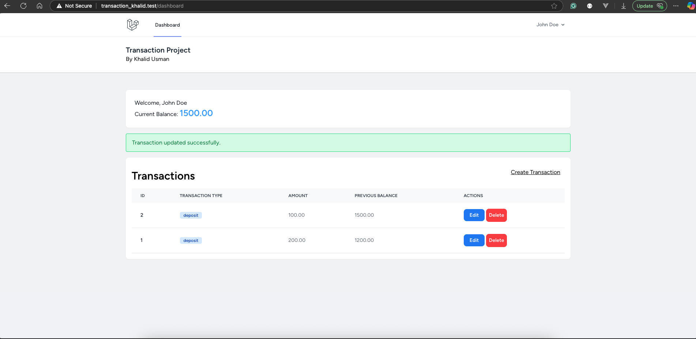

<p align="center"><a href="https://laravel.com" target="_blank"></a></p>

## Simple Transaction Project written in Laravel
#### Khalid Usman


## Project Setup
``` git clone https://github.com/kusman28/simple_transaction.git ```

- cd simple_transaction

``` cp .env.example .env ```
- Set the ENV variables for database config

``` composer install ```

``` npm install ```

``` php artisan migrate --seed ```

``` php artisan serve ```

## Credentials
- email ```johndoe@example.com```
- password ```password@2025```

<p align="center">
    
</p>
